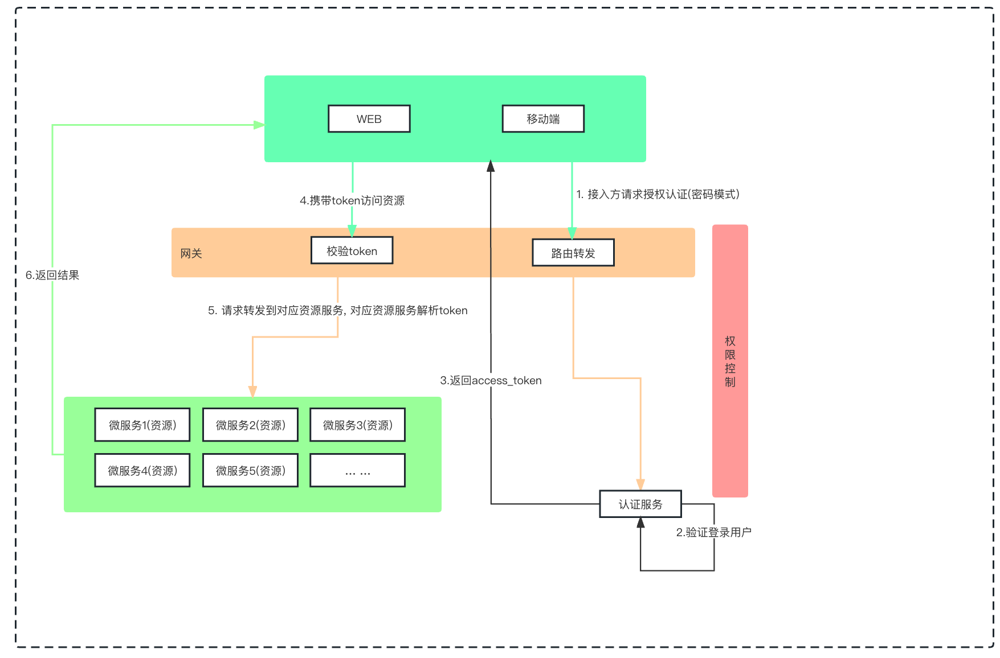
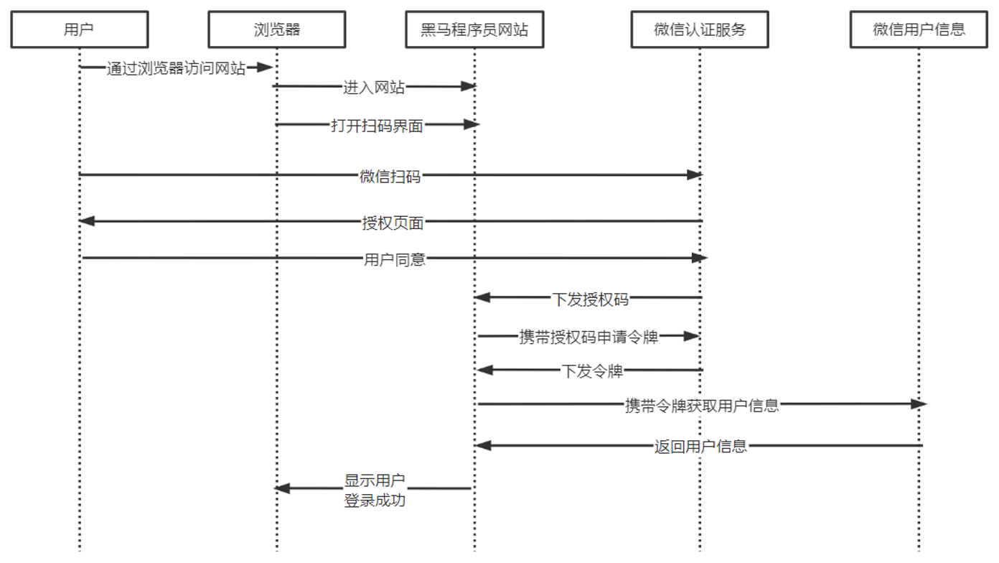

# SpringSecurityOAuth2微服务实战
## 系统模块

~~~
Security-demo-Cloud
├── security-gateway         // 网关模块 [9090]
├── security-auth            // 授权服务 [9200]
├── security-api             // 接口模块
│       └── security-api-system                          // 系统接口
├── security-common          // 通用模块
│       └── security-common-core                         // 核心模块
│       └── security-common-redis                        // 缓存服务
│       └── security-common-security                     // 安全模块(资源服务配置)
├── security-modules         // 业务模块
│       └── security-system                              // 系统模块 [9201]
├──pom.xml                // 公共依赖
~~~
> 系统架构

> 微信扫码登录流程

